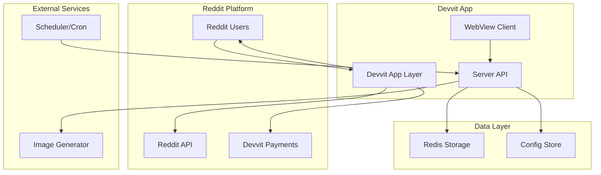

# Design Document

## Overview

The Karma Lemonade Stand is a Reddit-integrated business simulation game built on the Devvit platform. The game transforms Reddit user statistics (karma, account age, awards) into business capabilities for running a virtual lemonade stand. Players make daily strategic decisions while experiencing dynamic conditions, seasonal festivals, and competitive leaderboards.

The system uses deterministic algorithms to ensure fairness while providing engaging gameplay through weather systems, market events, and themed festivals. A payment system allows struggling players to purchase temporary boosts, maintaining competitive balance through transparent indicators and separate leaderboards.

## Architecture

### High-Level Architecture



### Component Architecture

The system follows Devvit's standard architecture pattern:

- **Devvit App Layer**: Handles Reddit integration, post creation, and user authentication
- **WebView Client**: React-based game interface with mobile-first design
- **Server API**: Express.js backend with game logic and data persistence
- **Redis Storage**: Game state, user data, leaderboards, and configuration
- **Scheduler**: Automated daily/weekly cycles and maintenance tasks

## Components and Interfaces

### 1. Game Engine Core

**Purpose**: Central game logic and scoring calculations

**Key Components**:
- `GameEngine`: Main orchestrator for game runs
- `ScoreCalculator`: Deterministic scoring algorithms
- `StatConverter`: Reddit stats to game stats conversion
- `DemandCalculator`: Customer demand calculation with all modifiers

**Interfaces**:
```typescript
interface GameRun {
  userId: string;
  price: number;
  adSpend: number;
  powerupReceipts?: PaymentReceipt[];
}

interface GameResult {
  profit: number;
  cupsSold: number;
  weather: WeatherType;
  event: MarketEvent;
  festival: FestivalTheme;
  streak: number;
  seed: string;
  powerupsApplied: string[];
}

interface UserStats {
  postKarma: number;
  commentKarma: number;
  accountAgeDays: number;
  awards: number;
  service: number;
  marketing: number;
  reputation: number;
}
```

### 2. Reddit Integration Service

**Purpose**: Fetch and process Reddit user data

**Key Components**:
- `RedditStatsService`: Retrieve user karma, age, awards
- `PostGenerator`: Create result posts with images
- `UserAuthService`: Handle Reddit authentication

**Interfaces**:
```typescript
interface RedditUserData {
  username: string;
  postKarma: number;
  commentKarma: number;
  accountCreated: Date;
  totalAwards: number;
}

interface ResultPost {
  title: string;
  imageUrl: string;
  buttons: PostButton[];
  footer: string;
}
```

### 3. Cycle Management System

**Purpose**: Handle daily and weekly game cycles

**Key Components**:
- `DailyCycleManager`: Generate daily conditions and reset counters
- `WeeklyCycleManager`: Generate festivals and reset leaderboards
- `SeedGenerator`: Create deterministic seeds for RNG
- `ConditionGenerator`: Generate weather, events, prices

**Interfaces**:
```typescript
interface DailyCycle {
  date: string;
  seed: string;
  weather: WeatherType;
  lemonPrice: number;
  sugarPrice: number;
  event: MarketEvent;
  multipliers: {
    demand: Record<WeatherType, number>;
    event: Record<MarketEvent, number>;
    cost: Record<MarketEvent, number>;
  };
  loginBonus: LoginBonusType;
}

interface WeeklyCycle {
  week: number;
  year: number;
  festival: FestivalTheme;
  modifiers: FestivalModifiers;
}
```

### 4. Festival Theme System

**Purpose**: Manage 30+ themed festivals with visual and gameplay effects

**Key Components**:
- `FestivalManager`: Select and apply festival themes
- `ThemeRenderer`: Apply visual themes to UI
- `ModifierApplicator`: Apply gameplay modifiers

**Festival Categories**:
```typescript
enum FestivalCategory {
  HOLIDAY = 'holiday',
  AESTHETIC = 'aesthetic', 
  ERA = 'era',
  GENRE = 'genre'
}

interface FestivalTheme {
  id: string;
  name: string;
  category: FestivalCategory;
  modifiers: {
    demandMultiplier?: number;
    priceVariance?: number;
    criticalSaleChance?: number;
    costVolatility?: number;
    specialEffects?: string[];
  };
  visualElements: {
    backgroundColor: string;
    standDecoration: string;
    uiTheme: string;
    iconSet: string;
  };
}
```

### 5. Payment System Integration

**Purpose**: Handle Devvit Payments for power-ups

**Key Components**:
- `PaymentProcessor`: Verify and process payment receipts
- `PowerupManager`: Apply power-up effects
- `ReceiptValidator`: Server-side payment verification
- `UsageLimiter`: Enforce daily purchase limits

**Interfaces**:
```typescript
interface PaymentReceipt {
  receiptId: string;
  userId: string;
  sku: string;
  amount: number;
  currency: string;
  signature: string;
  issuedAt: number;
}

interface PowerupEffect {
  type: 'SUPER_SUGAR';
  demandBonus: number;
  serviceBonus: number;
  duration: 'single_run';
}
```

### 6. Leaderboard System

**Purpose**: Track and display competitive rankings

**Key Components**:
- `LeaderboardManager`: Update and maintain rankings
- `ScoreTracker`: Track personal bests and streaks
- `RankingCalculator`: Determine leaderboard positions

**Interfaces**:
```typescript
interface LeaderboardEntry {
  userId: string;
  username: string;
  score: number;
  rank: number;
  powerupUsed: boolean;
  timestamp: Date;
}

interface Leaderboard {
  type: 'daily' | 'weekly';
  date: string;
  entries: LeaderboardEntry[];
  pure?: LeaderboardEntry[]; // No power-ups
}
```

## Data Models

### Redis Data Structure

**Configuration Keys**:
```
config:global -> Global game configuration
cycle:today -> Current daily cycle data
cycle:week -> Current weekly cycle data
```

**User Data Keys**:
```
user:{userId} -> User profile and stats
user:{userId}:powerups -> Daily power-up usage
user:{userId}:streak -> Streak tracking
user:{userId}:history -> Game history
```

**Leaderboard Keys**:
```
leaderboard:daily -> Daily rankings
leaderboard:weekly -> Weekly rankings
leaderboard:daily:pure -> Daily pure rankings
leaderboard:weekly:pure -> Weekly pure rankings
```

**Payment Keys**:
```
purchases:{receiptId} -> Payment verification data
rate_limit:{userId}:runs -> Rate limiting counters
rate_limit:{userId}:purchases -> Purchase rate limiting
```

### Core Data Models

**User Profile**:
```typescript
interface UserProfile {
  userId: string;
  username: string;
  redditStats: {
    postKarma: number;
    commentKarma: number;
    accountAgeDays: number;
    awards: number;
    lastUpdated: Date;
  };
  gameStats: {
    service: number;
    marketing: number;
    reputation: number;
  };
  progress: {
    totalRuns: number;
    currentStreak: number;
    bestProfit: number;
    lastPlayDate: string;
  };
  powerups: {
    usedToday: Record<string, number>;
    lastResetDate: string;
  };
}
```

**Game Configuration**:
```typescript
interface GameConfig {
  version: number;
  game: {
    sessionDurationSec: number;
    minPrice: number;
    maxPrice: number;
    minAdSpend: number;
    maxAdSpend: number;
  };
  economy: {
    baseCustomers: number;
    priceElasticity: number;
    adEffect: number;
    reputationEffect: number;
    inventoryCostPerCup: number;
    fixedCostPerDay: number;
  };
  statScaling: {
    ckToService: number;
    pkToMarketing: number;
    ageDaysToRep: number;
  };
  limits: {
    maxPostsPerUserPerDay: number;
    minSecondsBetweenRuns: number;
  };
  payments: {
    powerups: Record<string, PowerupConfig>;
  };
  festivals: Record<string, FestivalTheme>;
}
```

## Error Handling

### Client-Side Error Handling

**Network Errors**:
- Retry failed API calls with exponential backoff
- Show user-friendly error messages for connection issues
- Cache game state locally for offline resilience

**Payment Errors**:
- Handle declined payments gracefully
- Show clear error messages for payment failures
- Allow gameplay to continue without power-ups

**Rate Limiting**:
- Display countdown timers for rate limits
- Explain rate limiting to users clearly
- Provide alternative actions when limited

### Server-Side Error Handling

**Reddit API Failures**:
- Implement fallback mechanisms for Reddit data
- Cache user stats with TTL for resilience
- Graceful degradation when Reddit is unavailable

**Payment Processing**:
- Validate all payment receipts server-side
- Handle payment verification failures
- Prevent duplicate consumption of receipts

**Data Consistency**:
- Use Redis transactions for atomic operations
- Implement data validation at all entry points
- Handle concurrent access to shared resources

## Testing Strategy

### Unit Testing

**Core Game Logic**:
- Test scoring algorithms with various inputs
- Verify stat conversion calculations
- Test demand calculation with all modifiers
- Validate festival effect applications

**Payment System**:
- Test receipt verification logic
- Verify usage limit enforcement
- Test power-up effect applications

**Cycle Management**:
- Test seed generation determinism
- Verify daily/weekly reset logic
- Test condition generation algorithms

### Integration Testing

**Reddit Integration**:
- Test user data retrieval
- Verify post creation functionality
- Test authentication flows

**Payment Integration**:
- Test Devvit Payments integration
- Verify receipt validation
- Test purchase flow end-to-end

**Data Persistence**:
- Test Redis operations
- Verify data consistency
- Test concurrent access scenarios

### End-to-End Testing

**Game Flow**:
- Complete game runs from start to finish
- Test leaderboard updates
- Verify result post generation

**Festival Cycles**:
- Test daily and weekly resets
- Verify festival theme applications
- Test visual theme changes

**Mobile Experience**:
- Test responsive design on mobile devices
- Verify touch interactions
- Test performance on mobile browsers

## Performance Considerations

### Client Performance

**Mobile Optimization**:
- Minimize bundle size for faster loading
- Optimize images and assets for mobile
- Use efficient rendering techniques
- Implement lazy loading for non-critical features

**Caching Strategy**:
- Cache static assets aggressively
- Cache API responses with appropriate TTL
- Use service workers for offline functionality

### Server Performance

**Redis Optimization**:
- Use efficient data structures
- Implement connection pooling
- Use pipelining for batch operations
- Set appropriate TTL values

**API Optimization**:
- Implement request caching
- Use compression for responses
- Optimize database queries
- Implement rate limiting

### Scalability

**Horizontal Scaling**:
- Design stateless server components
- Use Redis for shared state
- Implement load balancing strategies

**Data Management**:
- Archive old leaderboard data
- Implement data cleanup routines
- Monitor storage usage

## Security Considerations

### Payment Security

**Receipt Validation**:
- Always verify payments server-side
- Validate receipt signatures
- Check receipt authenticity with Devvit
- Prevent replay attacks

**Usage Tracking**:
- Track power-up usage securely
- Prevent client-side manipulation
- Implement server-side validation

### Game Integrity

**Anti-Cheat Measures**:
- Use deterministic algorithms
- Validate all calculations server-side
- Implement rate limiting
- Monitor for suspicious patterns

**Data Protection**:
- Sanitize all user inputs
- Implement proper authentication
- Use secure communication channels
- Follow Reddit's privacy guidelines

## Deployment Strategy

### Development Environment

**Local Development**:
- Use `npm run dev` for live development
- Implement hot reloading for client
- Use Redis locally for development
- Mock external services for testing

### Production Deployment

**Devvit Deployment**:
- Use `npm run launch` for production
- Implement proper error monitoring
- Set up logging and analytics
- Configure production Redis instance

**Monitoring**:
- Track game metrics and KPIs
- Monitor payment transactions
- Set up alerts for system issues
- Implement health checks

This design provides a comprehensive foundation for implementing the Karma Lemonade Stand game while ensuring scalability, security, and maintainability.
