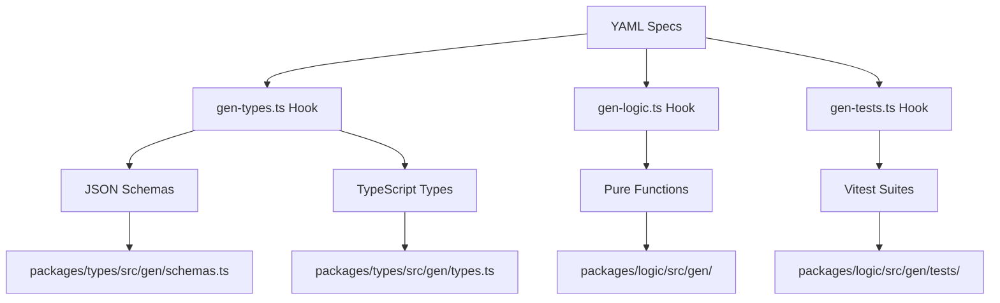

# Design Document

## Overview

Bitpixi's Bar is a sophisticated drink-making game that transforms the current single-app Devvit project into a comprehensive pnpm monorepo with automated code generation, Redis persistence, and community-driven content creation. The system leverages Kiro's spec-driven development workflow to generate types, validators, and business logic from YAML specifications, creating a maintainable and extensible architecture.

The game features a progressive three-phase experience:
1. **Zoomed Out View**: Playful bar scene with Bitpixi attendant and top 3 featured drinks displayed behind the bartender
2. **Drink Creation Phase**: Zoomed in drink creation with full-screen mixing interface, submit for community voting
3. **Component Creation Phase**: After 1 drink, unlock custom component design (glasses, backdrops, flavors, toppings) that also get voted on for inclusion in the system pool

## Architecture

### Monorepo Structure

```
bitpixis-bar/
├── apps/
│   ├── client/           # Three.js web application
│   └── devvit/           # Devvit Web interactive posts
├── packages/
│   ├── logic/            # Pure TypeScript game logic
│   │   ├── src/
│   │   │   ├── gen/      # Generated logic functions
│   │   │   └── index.ts  # Public API
│   │   └── package.json
│   ├── redis/            # Redis adapters and Lua scripts
│   │   ├── src/
│   │   │   ├── client.ts # ioredis client setup
│   │   │   ├── adapters/ # Typed data access layer
│   │   │   └── lua/      # Atomic Lua scripts
│   │   └── package.json
│   └── types/            # Generated types and schemas
│       ├── src/
│       │   ├── gen/      # Generated from specs
│       │   └── index.ts  # Re-exports
│       └── package.json
├── .kiro/
│   ├── specs/            # YAML specifications
│   │   ├── drink.yaml
│   │   └── shop.yaml
│   ├── hooks/            # Automation scripts
│   └── steering.yaml     # Development guidelines
└── pnpm-workspace.yaml
```

### Migration Strategy

The current `src/` structure will be migrated as follows:
- `src/client/` → `apps/client/`
- `src/server/` → `apps/devvit/` (enhanced with multiple post types)
- `src/shared/` → `packages/types/` (with generated content)

## Components and Interfaces

### 1. Specification System

#### Drink Specification (`drink.yaml`)
```yaml
version: 2
name: bitpixi-drink
fields:
  - id: glass
    type: enum
    values: [tall, short, mug, potion, martini]
  - id: backdrop
    type: enum
    values: [counter, neon, pumpkin_night, snow_window]
  - id: base
    type: enum
    values: [coffee, tea, milk, juice, soda]
  - id: flavors
    type: string[]
    max: 3
  - id: toppings
    type: string[]
    max: 3
  - id: mixMode
    type: enum
    values: [blend, layered]
  - id: color
    type: string
    pattern: "^#([A-Fa-f0-9]{6})$"
    required_if: "mixMode === 'blend'"
  - id: layers
    type: object[]
    optional: true
    required_if: "mixMode === 'layered'"
    schema:
      color: { type: string, pattern: "^#([A-Fa-f0-9]{6})$" }
      percent: { type: number, min: 1, max: 100 }
  - id: name
    type: string
    max: 24
  - id: font
    type: enum
    values: [script, serif, sans-serif, decorative, handwritten]
validation:
  layered:
    maxLayers: 4
    totalPercent: 100
  bannedWords: ["alcohol", "beer", "wine"]
```

#### Shop Specification (`shop.yaml`)
```yaml
version: 1
name: bitpixi-shop
states: [PENDING, FEATURED, RETIRED]
thresholds:
  featured: 25
  retired: -5
events:
  onVote: ["recalcScore", "promoteDemote"]
playerProgression:
  unlockCustomComponents: 1  # drinks created
```

### 2. Generated Code Architecture

#### Type Generation Flow


#### Generated Logic Functions
- `mixColor(colors: string[], weights?: number[], seed?: number): string`
- `formatDrinkSummary(drink: Drink): string`
- `validateDrink(drink: Drink): ValidationResult`
- `calculateLayerPercentages(layers: Layer[]): Layer[]`
- `generateDrinkId(drink: Drink, timestamp: number): string`

### 3. Redis Data Layer

#### Data Models
```typescript
// Redis Keys Structure
interface RedisKeys {
  // Drink metadata
  'drink:{id}': {
    state: 'PENDING' | 'FEATURED' | 'RETIRED';
    score: number;           // Aggregated from Reddit votes
    authorUid: string;
    thumbUrl: string;
    createdAt: number;
    redditPostId: string;    // Required - links to Reddit post
  };
  
  // Drink recipe (JSON or RedisJSON)
  'drink:{id}:json': Drink;
  
  // Vote tracking (mirrors Reddit votes in Redis for fast access)
  'drink:votes:{id}': Record<string, 1 | -1>;
  
  // Featured leaderboard
  'drinks:featured': { [drinkId: string]: number }; // ZSET
  
  // Rate limiting
  'rl:{action}:{uid}': { [timestamp: string]: number }; // ZSET
  
  // Player progression
  'player:{uid}:stats': {
    drinksCreated: number;
    customComponentsUnlocked: boolean;
  };
}
```

#### Lua Scripts
- `voteDrink.lua`: Atomic vote processing that syncs Reddit votes to Redis and updates aggregated scores
- `rateLimit.lua`: Sliding window rate limiting
- `promoteRetire.lua`: Automatic state transitions based on aggregated Reddit vote thresholds
- `syncRedditVotes.lua`: Batch sync Reddit post votes to Redis for score calculation

### 4. Devvit Post Components

#### SubmitDrinkPost
- **Purpose**: Drink creation and submission interface (Phase 2)
- **Components**:
  - Automatically created when player submits drink from game
  - Displays drink image, recipe details, and creator info
  - Community voting interface (👍/👎) 
  - Real-time score updates and promotion to featured status
- **Integration**: Created automatically from game client, votes aggregated in Redis

#### SubmitComponentPost  
- **Purpose**: Custom component submission interface (Phase 3)
- **Components**:
  - Displays custom component (glass, backdrop, flavor, topping)
  - Component preview and usage demonstration
  - Community voting on component quality and usefulness
  - Integration into system pool upon approval
- **Validation**: Component meets quality standards and game balance

#### VoteFeedPost
- **Purpose**: Community voting dashboard for all submissions
- **Components**:
  - Tabbed interface: "Drinks" and "Components"
  - Paginated list of PENDING items with thumbnails
  - Voting buttons that update Reddit and Redis scores
  - Live score updates and state badges
  - Rate limiting to prevent spam voting
- **Integration**: Aggregates votes from Reddit to Redis for promotion logic

#### FeaturedMenuPost
- **Purpose**: Showcase top-rated content and game entry point
- **Components**:
  - Top 3 featured drinks (matches bar scene display)
  - Recently approved custom components
  - "Play Game" button to launch main interface
  - Leaderboards for top creators
  - "Try in Game" deep links with drink/component parameters

### 5. Three.js Client Architecture

#### Scene Management
```typescript
interface SceneManager {
  // View states
  currentView: 'bar' | 'mixing' | 'component-design';
  
  // Scene objects
  barScene: THREE.Scene;              // Zoomed out bar view with top 3 drinks display
  mixingScene: THREE.Scene;           // Zoomed in drink creation
  componentDesignScene: THREE.Scene;  // Component creation interface
  
  // Cameras
  barCamera: THREE.PerspectiveCamera;
  mixingCamera: THREE.PerspectiveCamera;
  designCamera: THREE.PerspectiveCamera;
  
  // Featured drinks display in bar scene
  featuredDrinksDisplay: THREE.Group;  // Shows top 3 drinks behind bartender
  defaultFeaturedDrinks: FeaturedDrink[]; // Default examples: girly, spooky, cyberpunk
  
  // Transition system
  transitionTo(view: ViewType, duration: number): Promise<void>;
  updateFeaturedDisplay(drinks: FeaturedDrink[]): void;
}
```

#### Drink Rendering System
```typescript
interface DrinkRenderer {
  // Glass models (loaded once, reused)
  glassModels: Map<GlassType, THREE.Mesh>;
  
  // Fill rendering
  renderBlendedFill(color: string, glass: THREE.Mesh): THREE.Mesh;
  renderLayeredFill(layers: Layer[], glass: THREE.Mesh): THREE.Group;
  
  // Toppings and decorations
  addToppings(toppings: string[], glass: THREE.Mesh): THREE.Group;
  
  // Backdrop system
  setBackdrop(backdrop: BackdropType): void;
  
  // Font rendering for drink names
  renderDrinkName(name: string, font: FontType): THREE.Mesh;
}
```

#### Animation System
- **Pour animations**: Liquid filling with realistic physics
- **Ingredient drops**: Satisfying "kerplunk" animations for toppings
- **Transition animations**: Smooth zoom between bar and mixing views
- **UI feedback**: Button presses, hover effects, validation feedback

### 6. Custom Component Creation System

#### Component Designer Interface
```typescript
interface ComponentDesigner {
  // Unlocked after 3 drinks
  isUnlocked(playerStats: PlayerStats): boolean;
  
  // Design tools
  createCustomGlass(shape: GlassShape): CustomGlass;
  createCustomBackdrop(image: ImageData): CustomBackdrop;
  createCustomFlavor(properties: FlavorProperties): CustomFlavor;
  createCustomTopping(model: ToppingModel): CustomTopping;
  
  // Submission system
  submitForApproval(component: CustomComponent): Promise<string>;
}
```

#### Community Approval Workflow
1. Player unlocks component creation after making 1 drink
2. Player chooses component type (glass, backdrop, flavor, topping) to design
3. Component created using in-game design tools
4. Component submitted as Reddit post for community voting
5. Community votes on component quality and usefulness
6. Components reaching vote threshold get added to system pool for all players
7. Creator attribution maintained with component usage stats

## Data Models

### Core Types (Generated)
```typescript
// Generated from drink.yaml
interface Drink {
  id: string;
  glass: GlassType;
  backdrop: BackdropType;
  base: BaseType;
  flavors: string[];
  toppings: string[];
  mixMode: 'blend' | 'layered';
  color?: string;
  layers?: Layer[];
  name: string;
  font: FontType;
  createdAt: number;
  authorUid: string;
}

interface Layer {
  color: string;
  percent: number;
}

// Generated from shop.yaml
interface DrinkState {
  id: string;
  state: 'PENDING' | 'FEATURED' | 'RETIRED';
  score: number;
  votes: Record<string, 1 | -1>;
  redditPostId?: string;
}
```

### Player Progression
```typescript
interface PlayerStats {
  uid: string;
  drinksCreated: number;
  customComponentsUnlocked: boolean;
  customComponentsCreated: CustomComponent[];
  featuredDrinks: string[];
  totalScore: number;
}
```

## Error Handling

### Validation Errors
- **Client-side**: Real-time validation with immediate visual feedback
- **Server-side**: Comprehensive validation before Redis storage
- **Generated validators**: Consistent error messages across all validation points

### Redis Errors
- **Connection failures**: Graceful degradation with local caching
- **Rate limiting**: Clear user feedback with retry timers
- **Data consistency**: Lua scripts ensure atomic operations

### Devvit Integration Errors
- **Reddit API failures**: Retry logic with exponential backoff
- **Post creation errors**: Fallback to draft storage
- **Authentication issues**: Clear error messages and re-auth flow

## Testing Strategy

### Generated Test Suites
Each hook generates comprehensive test coverage:

#### Validation Tests (`gen-tests.ts`)
- Blend mode requires valid hex color
- Layered mode layers sum to exactly 100%
- Maximum layer count enforcement (4)
- Flavor and topping limits (3 each)
- Name length and banned word filtering
- Font selection validation

#### Business Logic Tests
- Color mixing determinism with seeds
- Drink promotion at score ≥ 25
- Drink retirement at score ≤ -5
- Rate limiting functionality
- Player progression unlocks

#### Integration Tests
- Redis data persistence
- Devvit post creation and updates
- Vote processing and score calculation
- Custom component approval workflow

### Coverage Requirements
- **packages/logic**: ≥ 85% coverage (enforced by CI)
- **packages/redis**: ≥ 80% coverage
- **Generated code**: 100% coverage (since it's generated)

### Testing Tools
- **Vitest**: Primary testing framework
- **Redis Memory Server**: In-memory Redis for tests
- **Mock Devvit SDK**: Isolated testing of Devvit integration
- **Three.js Test Utils**: Headless rendering for visual tests

## Performance Considerations

### Client Optimization
- **Model caching**: Glass models loaded once and reused
- **Texture atlasing**: Backdrop textures combined for efficiency
- **LOD system**: Different detail levels based on view distance
- **Animation pooling**: Reuse animation objects to reduce GC pressure

### Redis Optimization
- **Connection pooling**: Efficient connection management with ioredis
- **Lua scripts**: Atomic operations reduce round trips
- **Data structure optimization**: Appropriate Redis data types for each use case
- **Caching strategy**: Frequently accessed data cached in memory

### Generated Code Optimization
- **Tree shaking**: Only import needed validation functions
- **Type-only imports**: Reduce bundle size with type-only imports
- **Lazy loading**: Load validation schemas on demand

This design provides a comprehensive foundation for building Bitpixi's Bar as a showcase of Kiro's spec-driven development capabilities while creating an engaging, community-driven drink-making game.
