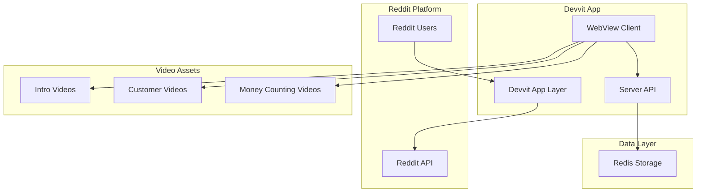

# Design Document

## Overview

Lemonomics is a video-driven lemonade stand game built on the Devvit platform. The game uses pre-rendered video assets featuring a ghost character to create an engaging, cinematic experience. Players make simple ingredient purchasing decisions and watch weather-specific video sequences that show the results of their choices.

The system is designed for simplicity, focusing on video playback, basic game logic, and minimal data persistence.

## Architecture

### High-Level Architecture



### Component Architecture

The system follows a simplified Devvit architecture:

- **Devvit App Layer**: Handles Reddit integration and user authentication
- **WebView Client**: React-based video player with simple UI controls
- **Server API**: Minimal Express.js backend for game state and leaderboard
- **Redis Storage**: Basic game sessions and leaderboard data
- **Video Assets**: Pre-rendered MP4 files for all game sequences

## Components and Interfaces

### 1. Video Manager

**Purpose**: Handle video playback and sequencing

**Key Components**:
- `VideoPlayer`: Controls video playback and transitions
- `VideoSequencer`: Manages the flow between different video types
- `WeatherSelector`: Randomly selects weather and corresponding videos

**Interfaces**:
```typescript
interface VideoAsset {
  type: 'intro' | 'customer' | 'money';
  weather?: WeatherType;
  filename: string;
  duration: number;
}

interface VideoSequence {
  intro: VideoAsset;
  customer: VideoAsset;
  money: VideoAsset;
}

enum WeatherType {
  SUNNY = 'sunny',
  CLOUDY = 'cloudy',
  RAINY = 'rainy'
}
```

### 2. Game Engine

**Purpose**: Simple game logic and state management

**Key Components**:
- `GameSession`: Tracks current game state
- `IngredientCalculator`: Handles purchase validation and sales calculation
- `ScoreCalculator`: Calculates daily profits based on weather and ingredients

**Interfaces**:
```typescript
interface GameState {
  day: number;
  cash: number;
  inventory: {
    lemons: number;
    sugar: number;
    cups: number;
  };
  currentWeather?: WeatherType;
  isActive: boolean;
}

interface DayResult {
  weather: WeatherType;
  cupsSold: number;
  revenue: number;
  costs: number;
  profit: number;
}

interface IngredientPrices {
  lemons: number;  // $0.05 each
  sugar: number;   // $0.02 per cup
  cups: number;    // $0.01 each
}
```

### 3. Leaderboard System

**Purpose**: Simple score tracking and display

**Key Components**:
- `LeaderboardManager`: Basic top scores tracking
- `ScoreSubmitter`: Records final game results

**Interfaces**:
```typescript
interface LeaderboardEntry {
  username: string;
  finalCash: number;
  daysPlayed: number;
  timestamp: Date;
}

interface GameResult {
  userId: string;
  username: string;
  finalCash: number;
  daysPlayed: number;
  totalRevenue: number;
}
```

## Data Models

### Redis Data Structure

**User Data Keys**:
```
user:{userId}:current_game -> Active game session
user:{userId}:saved_game -> Saved game progress for resumption
leaderboard:top_scores -> Top 10 players by final cash
```

### Core Data Models

**Game Session**:
```typescript
interface GameSession {
  userId: string;
  username: string;
  startTime: Date;
  currentDay: number;
  cash: number;
  inventory: {
    lemons: number;
    sugar: number;
    cups: number;
  };
  dailyResults: DayResult[];
  isActive: boolean;
}
```

## User Flow and Game Screens

### 1. Introduction Screen
- Play ghost lemonade stand intro video
- "Start Game" button appears after video
- Simple, engaging entry point

### 2. Ingredient Selection Screen
- Play notepad video as background
- Overlay interactive controls on top of video:
  - Current cash and day number
  - Quantity selectors for lemons ($0.05 each), sugar ($0.02 per cup), cups ($0.01 each)
  - Real-time cost calculation
  - "Start Selling" button when ready
- Ensure UI elements are positioned to match notepad layout

### 3. Customer Scene
- Randomly select weather (sunny/cloudy/rainy)
- Play appropriate customer buying video
- No user interaction during video
- Automatic transition to results

### 4. Daily Results
- Play weather-specific money counting video
- After money counting completes, reveal day number and amount earned
- Display final profit amount and updated cash total
- Three navigation options: "Next Day", "Restart" (with confirmation), "Save Game and Post Progress"

### 5. Save and Post Screen
- Display leaderboard background
- Show Reddit post preview with player's progress
- Automatically subscribe to r/Lemonomics
- Save game state for later resumption

### 6. Game Over Screen
- Final statistics (days played, total cash)
- Simple leaderboard (top 10 players)
- Player's position highlighted
- "Play Again" button

## Video Asset Management

### Video File Organization
```
/public/videos/
├── intro/
│   └── ghost-intro.mp4
├── customers/
│   ├── sunny-customers.mp4
│   ├── cloudy-customers.mp4
│   └── rainy-customers.mp4
└── money/
    ├── sunny-money.mp4
    ├── cloudy-money.mp4
    └── rainy-money.mp4
```

### Video Playback Strategy

**Preloading**:
- Preload intro video on app start
- Preload weather videos based on selection
- Use HTML5 video preload attributes

**Transitions**:
- Seamless transitions between video sequences
- Loading states for video buffering
- Fallback for video loading failures

**Mobile Optimization**:
- Compressed video files for mobile
- Responsive video player
- Touch-friendly controls

## Game Logic

### Sales Calculation

**Base Demand**: 30 customers per day

**Weather Effects**:
- Sunny: 1.5x demand multiplier
- Cloudy: 1.0x demand multiplier  
- Rainy: 0.6x demand multiplier

**Ingredient Constraints**:
- Each cup requires: 1 lemon, 1 sugar, 1 cup
- Sales limited by lowest ingredient quantity
- Excess ingredients carry over to next day

**Profit Calculation**:
```
Revenue = Cups Sold × Price per Cup ($0.25)
Costs = Ingredient purchases for the day
Profit = Revenue - Costs
```

## Error Handling

### Video Playback Errors

**Loading Failures**:
- Show loading spinner during video buffering
- Fallback to static images if video fails
- Retry mechanism for network issues

**Playback Issues**:
- Skip to next sequence if video won't play
- Provide manual "Continue" button as backup
- Log errors for debugging

### Game State Errors

**Data Persistence**:
- Auto-save game state after each day
- Recover from Redis failures gracefully
- Validate all game state changes

**Network Issues**:
- Cache game state locally when possible
- Retry failed API calls
- Graceful degradation for offline play

## Performance Considerations

### Video Performance

**File Optimization**:
- Compress videos for web delivery
- Multiple quality options for different connections
- Efficient video codecs (H.264/WebM)

**Loading Strategy**:
- Progressive video loading
- Preload next video during current playback
- Lazy load non-critical videos

### Client Performance

**React Optimization**:
- Minimal re-renders during video playback
- Efficient state management
- Component memoization where appropriate

**Memory Management**:
- Unload unused video elements
- Clean up video resources after playback
- Monitor memory usage on mobile devices

## Testing Strategy

### Video Integration Testing

**Playback Testing**:
- Test all video sequences on different devices
- Verify smooth transitions between videos
- Test video loading and error handling

**Game Flow Testing**:
- Complete game sessions from start to finish
- Test all weather combinations
- Verify score calculations match video content

### Cross-Platform Testing

**Mobile Testing**:
- Test video playback on iOS and Android
- Verify touch interactions work properly
- Test different screen orientations

**Browser Compatibility**:
- Test video formats across browsers
- Verify fallback mechanisms work
- Test performance on slower devices

This design provides a solid foundation for a video-driven lemonade stand game that leverages your existing video assets while maintaining simplicity and ensuring great performance across devices.
