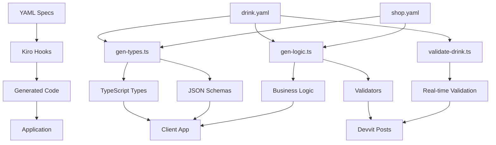

## Devvit Three.js Starter

A starter to build web applications on Reddit's developer platform

- [Devvit](https://developers.reddit.com/): A way to build and deploy immersive games on Reddit
- [Vite](https://vite.dev/): For compiling the webView
- [Three.js](https://threejs.org/): For 3D animations and physics
- [Express](https://expressjs.com/): For backend logic
- [Typescript](https://www.typescriptlang.org/): For type safety

## Getting Started

> Make sure you have Node 22 downloaded on your machine before running!

1. Run `npm create devvit@latest --template=threejs`
2. Go through the installation wizard. You will need to create a Reddit account and connect it to Reddit developers
3. Copy the command on the success page into your terminal

## Commands

- `npm run dev`: Starts a development server where you can develop your application live on Reddit.
- `npm run build`: Builds your client and server projects
- `npm run deploy`: Uploads a new version of your app
- `npm run launch`: Publishes your app for review
- `npm run login`: Logs your CLI into Reddit
- `npm run check`: Type checks, lints, and prettifies your app

## Cursor Integration

This template comes with a pre-configured cursor environment. To get started, [download cursor](https://www.cursor.com/downloads) and enable the `devvit-mcp` when prompted.

## Kiro Spec-Driven Workflow

This project showcases Kiro's spec-driven development methodology, where YAML specifications automatically generate TypeScript types, validators, and business logic.

### How Specs → Hooks → Codegen Works



### Development Process

1. **Requirements** - Define user stories with EARS format acceptance criteria
2. **Design** - Create comprehensive architecture from requirements  
3. **Specifications** - Write YAML specs that capture the design
4. **Code Generation** - Hooks automatically generate implementation code
5. **Implementation** - Build features using generated types and logic

### Key Files

#### Specifications
- `.kiro/specs/drink.yaml` - Drink recipe schema and validation rules
- `.kiro/specs/shop.yaml` - Voting system and player progression
- `.kiro/steering.yaml` - Development conventions and guidelines

#### Generated Code (DO NOT EDIT)
- `packages/types/src/gen/types.ts` - TypeScript interfaces
- `packages/types/src/gen/schemas.ts` - JSON Schema definitions
- `packages/logic/src/gen/validators.ts` - Validation functions
- `packages/logic/src/gen/color-mixing.ts` - Color blending logic
- `packages/logic/src/gen/drink-formatting.ts` - Reddit post formatting

#### Hooks (Automation)
- `.kiro/hooks/gen-types.ts` - Generate types from specs
- `.kiro/hooks/gen-logic.ts` - Generate business logic
- `.kiro/hooks/validate-drink.ts` - Real-time validation

### Running the Demo

1. **Edit a specification:**
   ```bash
   # Add a new backdrop to drink.yaml
   vim .kiro/specs/drink.yaml
   ```

2. **Regenerate code:**
   ```bash
   npx tsx .kiro/hooks/gen-types.ts
   npx tsx .kiro/hooks/gen-logic.ts
   ```

3. **See the changes:**
   ```bash
   # New types automatically available
   cat packages/types/src/gen/types.ts
   ```

4. **Build and test:**
   ```bash
   pnpm run build
   pnpm run test
   ```

### Architecture Benefits

- **Type Safety** - Generated types ensure consistency across client/server
- **Validation** - Single source of truth for validation rules
- **Maintainability** - Changes to specs automatically update all code
- **Testing** - Deterministic functions with seeded randomization
- **Documentation** - Specs serve as living documentation

### Game Features

- **Progressive Gameplay** - Zoomed-out bar → drink creation → component design
- **Community Voting** - Reddit integration with automatic post creation
- **Custom Components** - Players create glasses, backdrops, flavors, toppings
- **Three.js Rendering** - Beautiful 3D drink visualization
- **Multiple Themes** - Girly, spooky Halloween, cyberpunk neon aesthetics

### Tech Stack

- **Frontend:** Three.js, TypeScript, Vite
- **Backend:** Devvit Web, Express, Redis
- **Build:** pnpm monorepo with project references
- **Testing:** Vitest with ≥85% coverage requirement
- **CI/CD:** GitHub Actions for type checking and testing

This project demonstrates how spec-driven development can create maintainable, type-safe applications with automated code generation and comprehensive testing.
